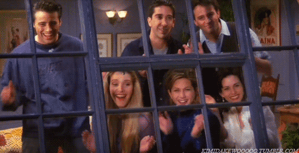

  

As a Computer Vision enthusiast, I decided to challenge myself. From now on, I will share my journey to learn OpenCV for 15 days. I planned to add daily python files and sources. You can check if I fail or if I become the OpenCV master. 👩🏻‍💻
  
📌 25.02.2023   
cv0.py: I used imread, imwrite and imshow(additionaly gray option) functions. I showed size, datatype, shape of image and difference between gray and original image. I also split image for blue, green and red. Finally I did some practice about pixels. 🥳  
📌 26.02.2023   
cv1.py: I captured the dog video,showed original version and additionally resized version. 
cv1.1.py: I worked on color effects for image and specific part of image. 
cv1.2.py: I worked on some basic OpenCV functions. I study converting image to grayscale, blurring, edge cascade, edge cascade for a blurry image,dilating, eroding, resizing and finally cropping. 🥳  
📌 27.02.2023  
cv2.0.py: face detection on image using haarcascade_frontalface_default.xml from openCV 
cv2.1.py: translating, rotating and flipping an image  
cv2.2.py: face detection on video using haarcascade_frontalface_default.xml from openCV and saving the video.  
📌 28.02.2023 
📌 01.03.2023 
📌 02.03.2023 
📌 03.03.2023 
📌 04.03.2023 
📌 05.03.2023 
📌 06.03.2023 
📌 07.03.2023 
📌 08.03.2023 
📌 09.03.2023 
📌 10.03.2023 
📌 11.03.2023 
  Sources: 
🐝 Full tutorial for OpenCV: https://www.youtube.com/watch?v=oXlwWbU8l2o  
🐝 Turkish video series for OpenCV: https://youtu.be/hRzBtQh6wuU  
🐝 No module named 'cv2' error solution: https://bobbyhadz.com/blog/python-no-module-named-cv2  
🐝 Saving video with openCV: https://www.geeksforgeeks.org/saving-a-video-using-opencv/  
🐝 haarcascade_frontalface_default.xml: https://github.com/opencv/opencv/tree/4.x/data/haarcascades
